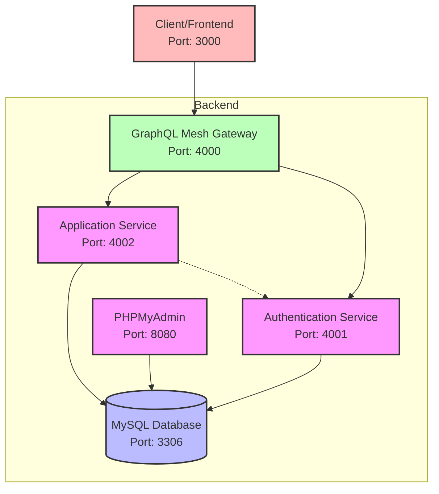

# SchooInc GraphQL API

A GraphQL API for managing school data including users, grades, and classes.

## Architecture

This project follows a microservices architecture with:
- Authentication Service: Handles user registration, login, and token management
- Main Application Service: Handles all other business logic (grades, classes, etc.)
- GraphQL Mesh Gateway: Federates the GraphQL APIs from different services
- MySQL Database: Stores all application data
- PHPMyAdmin: Database management interface

### Architecture Diagram



## Prerequisites

- Docker and Docker Compose
- Node.js (for local development)

## Getting Started

1. Clone this repository
2. Run `docker-compose up` to start all services
3. Access the GraphQL playground at http://localhost:4000/graphql
4. Access PHPMyAdmin at http://localhost:8080 (username: root, password: password)
5. Access the frontend at http://localhost:3000

## Seeding the Database

To populate the database with sample data:

```bash
# First, make sure the containers are running
docker-compose up -d

# Then, run the seed script in the app-service container
docker-compose exec app-service npm run seed
```

This will create sample users, classes, courses, and grades for testing.

## Services

### Authentication Service (Port 4001)
Handles:
- User registration
- User login
- Token validation

### Main Application Service (Port 4000)
Handles:
- User management (CRUD)
- Grade management
- Class management
- Statistics for grades

## API Documentation

### Authentication

#### Register a new user
```graphql
mutation {
  register(email: "user@example.com", pseudo: "User Name", password: "password123", role: student) {
    token
    user {
      id
      email
      pseudo
      role
    }
  }
}
```

#### Login
```graphql
mutation {
  login(email: "user@example.com", password: "password123") {
    token
    user {
      id
      email
      pseudo
      role
    }
  }
}
```

### User Management

#### Get current user
```graphql
query {
  me {
    id
    email
    pseudo
    role
    classes {
      id
      name
    }
    grades {
      id
      value
      course {
        name
      }
    }
  }
}
```

#### Update user
```graphql
mutation {
  updateUser(id: "1", pseudo: "New Name") {
    id
    pseudo
  }
}
```

### Grades

#### Get my grades
```graphql
query {
  myGrades {
    id
    value
    comment
    date
    course {
      id
      name
    }
  }
}
```

#### Create a grade (professor only)
```graphql
mutation {
  createGrade(value: 15, comment: "Good work", courseId: "1", studentId: "3") {
    id
    value
    comment
  }
}
```

### Classes

#### Get all classes
```graphql
query {
  classes(sortBy: "name") {
    id
    name
    description
    year
    students {
      id
      pseudo
    }
    courses {
      id
      name
    }
  }
}
```

#### Add student to class (professor only)
```graphql
mutation {
  addStudentToClass(classId: "1", studentId: "3") {
    id
    name
    students {
      id
      pseudo
    }
  }
}
```

### Statistics (professor only)

#### Get class grade statistics
```graphql
query {
  classGradeStats(classId: "1") {
    className
    stats {
      average
      median
      lowest
      highest
      count
    }
  }
}
```

## Testing

To run tests:

```bash
# For auth service
docker-compose exec auth-service npm test

# For app service
docker-compose exec app-service npm test
```
